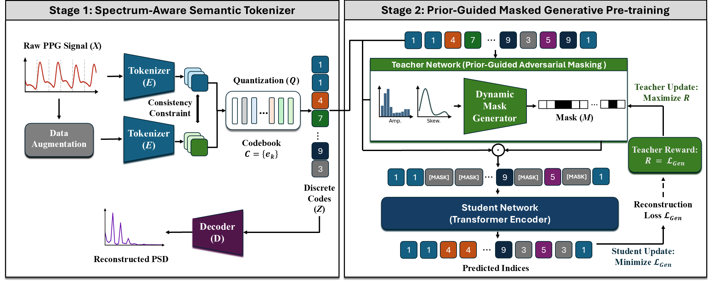

# SIGMA-PPG

Official implementation of the paper: SIGMA-PPG ([https://arxiv.org/html/2601.21031v1](https://arxiv.org/abs/2601.21031))

## 📝 Abstract
Current foundation model for photoplethysmography (PPG) signals is challenged by the intrinsic redundancy and noise of the signal. Standard masked modeling often yields trivial solutions while contrastive methods lack morphological precision. To address these limitations, we propose a Statistical-prior Informed Generative Masking Architecture (SIGMA-PPG), a generative foundation model featuring a Prior-Guided Adversarial Masking mechanism, where a reinforcement learning-driven teacher leverages statistical priors to create challenging learning paths that prevent overfitting to noise. We also incorporate a semantic consistency constraint via vector quantization to ensure that physiologically identical waveforms—even those altered by recording artifacts or minor perturbations—map to shared indices. This enhances codebook semantic density and eliminates redundant feature structures. Pre-trained on over 120,000 hours of data, SIGMA-PPG achieves superior average performance compared to five state-of-the-art baselines across 12 diverse downstream tasks.
<div align="center" style="margin-top: 30px;">
  
</div>


## 🛠️ Environment Setup
```bash
pip install -r requirements.txt
```
## ✨ Quick Start


Download the checkpoint on [Hugging Face](https://huggingface.co/zonhengu/sigmappg/tree/main) and try our pretrained model on your task
```bash
import torch
from einops import rearrange
from downstream.model_select import select_model

# --- 1. Configuration ---
SAMPLING_RATE = 50       # Acts as the PATCH_SIZE for one second (e.g., 50Hz)
INPUT_LENGTH = 1000      # Total length of the input PPG signal
CHECKPOINT_PATH = 'sigma.pth'

# --- 2. Model Initialization ---
model, _ = select_model(
    backbone='sigma_ppg_pro',
    num_classes=1,
    in_chans=1,
    pretrained=True,
    checkpoint_path=CHECKPOINT_PATH,
    freeze_backbone_flag=False,
    device=torch.device('cuda' if torch.cuda.is_available() else 'cpu'),
    patch_size=SAMPLING_RATE, 
    input_size=INPUT_LENGTH
)

# --- 3. Training Loop ---
# Assuming loader yields 'x' with shape: [Batch, Channel, Length]
for step, (x, y) in enumerate(loader):
    
    # Transforms the raw 3D signal into a 4D tensor.
    # Shape: [Batch, Channel, Length] -> [Batch, Channel, Num_Patches, Patch_Size]
    # Here, 't' is fixed to SAMPLING_RATE, and 'n' (number of patches) is inferred.
    x = rearrange(x, 'b c (n t) -> b c n t', t=SAMPLING_RATE)

    # Forward pass
    output = model(x)
```


## 🚀 Running Experiments
If you want to reproduce the results of the pretraining, please follow the steps below.

### 1. Preprocessing
Using [mimic iii matched subset database](https://physionet.org/content/mimic3wdb-matched/1.0/) as an example, if you need to preprocess your own data, please modify preprocessing/processor.py.
```bash
python preprocessing_main.py --dataset_name mimic_iii --raw_data_path ./raw_data --seg_save_path ./processed_data 
```

### 2. Training Tokenizer
```bash
OMP_NUM_THREADS=1 torchrun --nnodes=1 --nproc_per_node=4 codebook_training.py \
    --data_path ./processed_data  \
    --output_dir ./checkpoints/codebook \
    --log_dir ./log/codebook \
    --codebook_n_emd 4096 \
    --codebook_emd_dim 64 \
    --quantize_kmeans_init \
    --batch_size 1024 \
    --clip_grad 1.0 \
    --opt adamw \
    --opt_betas 0.9 0.99 \
    --warmup_epochs 10 \
    --epochs 100 \
    --save_ckpt_freq 20 \
    --use_consistency_loss
```

### 3. Pretraining SIGMA-PPG
```bash
OMP_NUM_THREADS=1 torchrun --nnodes=1 --nproc_per_node=4 pretraining_main.py \
    --data_path ./processed_data \
    --output_dir ./checkpoint \
    --log_dir ./log/pretrain \
    --model sigma_pro_patch100_12000_8k_vocab \
    --tokenizer_model vqnsp_encoder_base_decoder_3x250x12 \
    --tokenizer_weight ./checkpoints/codebook/checkpoint-99.pth \
    --input_size 12000 \
    --batch_size 1024 \
    --lr 5e-4 \
    --warmup_epochs 10 \
    --clip_grad 1.0 \
    --opt_eps 1e-8 \
    --epochs 80 \
    --save_ckpt_freq 10 \
    --codebook_dim 64 \
    --gradient_accumulation_steps 2 \
    --codebook_size 4096 \
    --no_symmetric_masking \
    --num_workers 20 \
    --teacher_warmup_ratio 0.0 \
    --use_knowledge_masking \
    --mask_max_len 5 \
    --use_teacher
```

### 4. Evaluating on Downstream Task
Use heart rate estimation on [BIDMC database](https://physionet.org/content/bidmc/1.0.0/) as an example.

**preprocess**
```bash
python downstream_main.py -dataset_name bidmc --stage preprocessing --raw_data_path "${DATA_PATH}" --seg_save_path "${SAVE_PATH}"
```
**Fine-tune**
```bash
python diffusionFM/downstream_main.py --dataset_name bidmc --stage training \
    --seg_save_path "${SAVE_PATH}" \
    --checkpoint_path "${CHECKPOINT}" \
    --backbone "sigma_ppg_pro" \
    --batch_size 64 \
    --lr 0.0005 \
    --epochs 100 \
    --warmup_epochs 20 \
    --task_name hr
```


